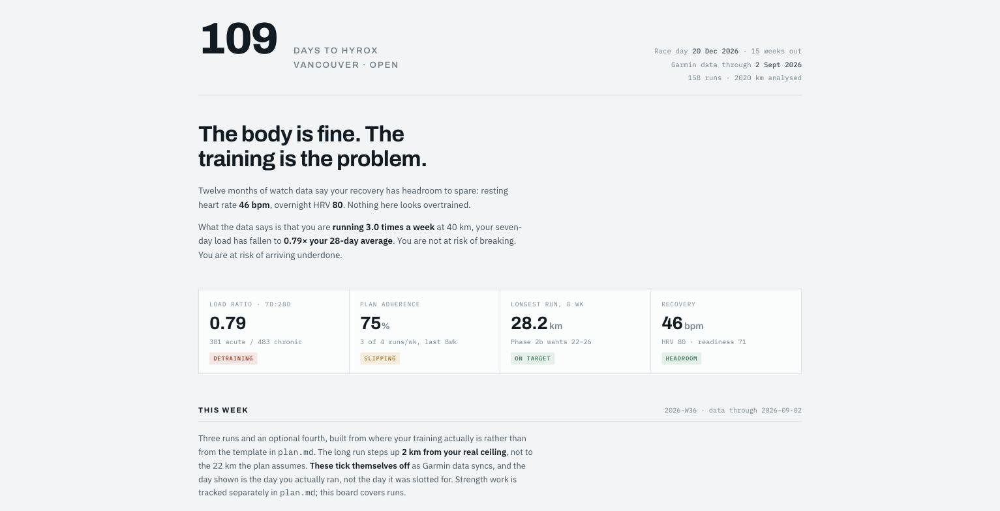
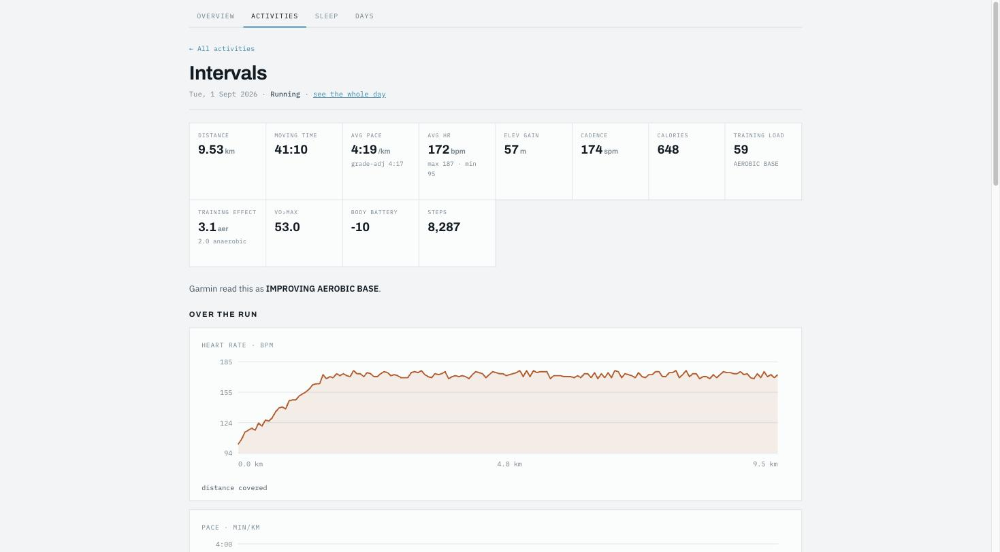
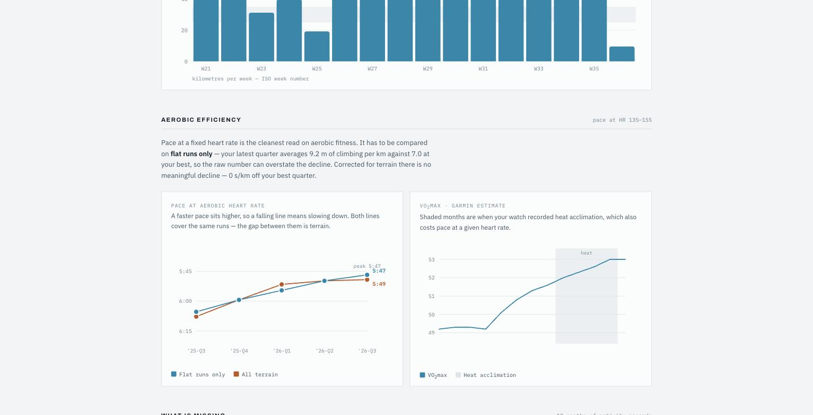
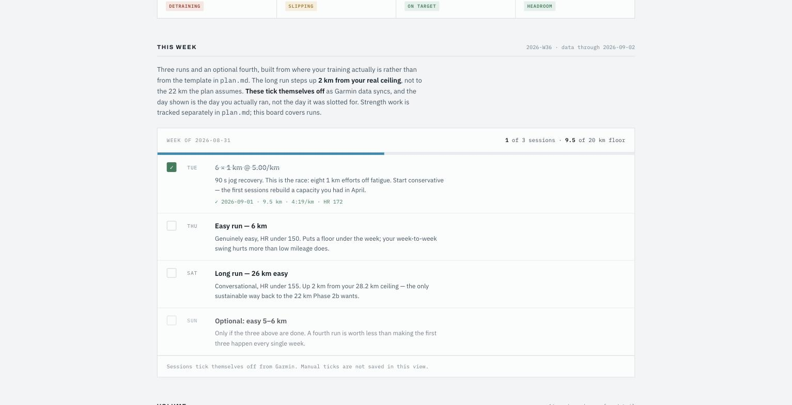

# garmin

Pulls your own Garmin Connect data into local CSVs, analyses it against a race
goal, and builds a dashboard you can publish and read each week.

Built because Garmin has no public personal API and broke every community auth
library in March 2026. Runs entirely on your machine; your health data never
leaves it.

```
./refresh.sh          # sync -> match this week's runs -> rebuild the dashboard
```



*Screenshots on this page are built from `demo_data.py`, a synthetic athlete, not
from anyone's real training. Run `./.venv/bin/python demo_data.py` and build with
`GARMIN_DATA_DIR=demo/data` to reproduce them.*

## Quick start

```bash
uv venv --python 3.12 .venv
uv pip install --python .venv/bin/python garminconnect curl_cffi pytest

./.venv/bin/python garmin_sync.py --login   # one-time; prompts for password + MFA
./.venv/bin/python garmin_sync.py --days 365
./refresh.sh
```

Tokens land in `~/.garminconnect` and last about six months. The same file works
with the [Taxuspt/garmin_mcp](https://github.com/Taxuspt/garmin_mcp) MCP server
if you want live queries alongside the local mirror.

## What it does

| Script | Job |
|---|---|
| `garmin_sync.py` | Garmin Connect &rarr; CSVs in `data/`. Incremental, re-runnable, upserts on key. |
| `analyze.py` | Full training report: volume, adherence, efficiency, load, recovery, sleep, verdict. `--write` also drops `insights/latest.md`. |
| `week_plan.py` | This week's prescribed runs, auto-matched against what you actually did. |
| `build_dashboard.py` | `dashboard.template.html` + CSVs &rarr; `dashboard.html`. |
| `refresh.sh` | All of the above in order. `--no-sync` to rebuild without hitting Garmin. |
| `sync_details.py` | Per-activity splits, HR zones, weather and a downsampled trace. One JSON per activity. |
| `demo_data.py` | A synthetic year of data, so the dashboard can be seen without a Garmin account. |
| `test_analyze.py` | Guards the two corrections below. Run after touching `analyze.py`. |

### Data

| File | Grain | Holds |
|---|---|---|
| `data/activities.csv` | one activity | type, distance, duration, pace, HR, cadence, elevation, training effect, load, VO2max |
| `data/sleep.csv` | one night | score, stage breakdown, resting HR, overnight HRV, respiration, body battery, sleep need |
| `data/daily.csv` | one day | steps, resting HR, HRV, stress, body battery, intensity minutes, training status, VO2max, heat acclimation |
| `data/readiness.csv` | one morning | readiness score, level, recovery time, acute load, contributing factors |
| `data/details/<id>.json` | one activity | per-lap splits, time in each HR zone, weather, and a ~160-point trace of HR, pace, elevation, cadence, power |
| `data/zones.json` | the athlete | Garmin's own max HR, threshold and zone floors |

`data/` in this repo is one athlete's real export, published deliberately. If you
fork this, decide for yourself &mdash; those files are a health record, and the
activity names carry location. Add `data/` to `.gitignore` if you would rather
keep yours local; everything still works, since the CSVs rebuild from Garmin in
one command.

## The dashboard

`build_dashboard.py` renders `dashboard.template.html` into a standalone
`dashboard.html` you can open locally or publish as a Claude Artifact.

**Never edit `dashboard.html`.** It is generated and overwritten on every
refresh. Edit `dashboard.template.html`.

The template is a complete page with two kinds of hole in it:

- `__DATA__` &mdash; replaced with one JSON blob holding every series the charts
  draw, plus the week's sessions. All rendering is done in the page from that blob.
- `{{token}}` &mdash; replaced at build time with a computed figure. The prose is
  full of these (`{{rhr}}`, `{{cv}}`, `{{fast_gap}}`, `{{sleep_cov}}` &hellip;), so no
  personal number is ever committed to the repo and a rebuild can't leave a stale
  claim on the page. `build_dashboard.py` **fails the build** if any token is
  left unfilled.

Sections, top to bottom:

1. **Race clock** &mdash; days out, phase, what data the page was built from
2. **Verdict** &mdash; the one-line read, then four stat tiles with severity pills
3. **This week** &mdash; prescribed runs, ticking themselves off (below)
4. **Volume** &mdash; 16 weeks of km against the plan's target band
5. **Aerobic efficiency** &mdash; pace at fixed HR, flat vs all-terrain, beside VO2max
6. **What is missing** &mdash; gaps measured against the race's actual demands
7. **Long run**, **seasonal load**, **recovery & sleep**, **what to change**

### Drilling in

The nav across the top opens three more views, all hash-routed inside the same
page so it stays a single file:

- **Activities** &mdash; every session, sortable on any column and filterable by
  type. Click a row for the full breakdown.
- **Sleep** &mdash; every night the watch was actually worn, with a stage
  breakdown per night.
- **Days** &mdash; one row per day: sessions, steps, resting HR, HRV, readiness,
  stress, body battery, training status. A row with no session is a genuine rest
  day; a *missing* row means the watch never synced, which is a different thing.

An **activity page** carries the summary tiles, a trace of heart rate, pace,
elevation and cadence over the distance covered, time in each heart-rate zone,
the weather it was run in, running dynamics (stride, ground contact, vertical
oscillation), and a per-lap split table with grade-adjusted pace and a bar
comparing each lap to the fastest and slowest of that run.



Every page cross-links: a run points at its day, a day points at its night and
back at its sessions.



Charts are hand-drawn inline SVG with a hover layer &mdash; no chart library, no
build step, no network dependency beyond the webfonts. Every axis scales to the
data it is given, and the verdict, the findings list and the stat pills are all
conditional: feed it a different athlete and it reaches different conclusions
rather than restating fixed ones.

### Try it without a Garmin account

```bash
./.venv/bin/python demo_data.py
GARMIN_DATA_DIR=demo/data ./.venv/bin/python build_dashboard.py --out demo/dashboard.html
open demo/dashboard.html
```

To publish it as an Artifact, ask Claude to republish to the URL in
`insights/ARTIFACT.txt`. Reusing that URL matters: a fresh publish makes a second
artifact and orphans any ticks stored against the first.



### The week board

`week_plan.py` prescribes three runs and an optional fourth, generated from where
your training actually is rather than from an aspirational template:

- the **long run** steps `LONG_STEP` km up from your real 4-week ceiling and is
  capped, so a missed week can't let the target run away from you
- **1 km repeats** are always present, because that is the unit Hyrox is made of
- an **easy run** fills whatever the weekly floor still needs

Sessions tick themselves off by matching `data/activities.csv`. Matching runs
most-specific-slot-first (long, then intervals, then easy) so a long run is never
consumed by the easy slot, and a completed row shows **the day you actually ran**,
not the day it was slotted for. Anything recorded that no session claimed is
still listed, so nothing you did goes uncounted.

Strength and station work are deliberately absent. Garmin has no record of any,
so a box for them could never resolve from data &mdash; that belongs in a plan file,
not on a board that reports measurements.

Published as an Artifact with the `db` capability, boxes can also be ticked by
hand (stored under `ticks/<week>__<session id>`) for a run the watch missed.

## Claude Code skills

`skills/` holds the two [Claude Code](https://claude.com/claude-code) skills that
drive this from conversation:

- **`skills/garmin`** &mdash; runs the refresh loop, reads the CSVs, and knows about
  the two data traps below so it does not re-derive the wrong conclusions.
- **`skills/training`** &mdash; holds the race plan and the subjective log that the
  Garmin data is judged against.

Copy them into `~/.claude/skills/` (or a project's `.claude/skills/`) to use them.
They are written for one athlete's setup; the paths and race details near the top
are the parts to change.

## Two data traps this handles

Both produced confidently wrong conclusions before they were caught, and both
are covered by `test_analyze.py`.

**Resting HR.** Garmin reports a `restingHeartRate` every single day, including
the nights the watch was not worn &mdash; on those it derives one from daytime
readings, and it runs materially high. On paired nights the two sources agree
exactly. Read naively, a "resting HR is improving!" trend can be nothing but a
record of how often you wore the watch. `analyze.py` reads resting HR only from
`sleep.csv` and reports how many values it excluded.

**Heart-rate zones.** Inferring a max HR from observed peaks understates it &mdash;
an all-out effort is rare &mdash; which drags every zone boundary down with it. This
reads Garmin's own zone model instead (`data/zones.json`). On the athlete in this
repo the inferred 194 was really 198, and correcting it moved the intensity
distribution from 38% to 71% in Z3: a completely different training picture.

**Units.** Garmin reports lap cadence in steps/min but series cadence per-leg,
and returns `-1` for "no data" on several wellness fields. Both are handled at
the point of ingestion; if you add a field, check its units against the app.

**Terrain.** Pace at a fixed heart rate is the cleanest read on aerobic fitness,
but only on comparable ground. A move to hillier routes can manufacture most of
an apparent decline. Every efficiency figure is computed on flat runs only
(`FLAT_M_PER_KM`), shown beside the all-terrain number so the gap is visible.
Heat acclimation, tracked in `daily.csv`, is the second confounder.

## Configuration

Athlete constants sit at the top of `analyze.py` (`MAX_HR`, the race date, the
aerobic HR band) and `week_plan.py` (`LONG_STEP`, `LONG_CAP`, `WEEK_FLOOR`,
`REP_PACE`). Set them before trusting the zone splits.

## Notes

- This is unofficial and not affiliated with Garmin. It signs in as you, to read
  your own data, through the same mobile SSO flow the Android app uses.
- Login cascades through five strategies; seeing the first one or two log a 429
  and fall through is normal, not a failure. `--verbose` shows the detail.
- If auth breaks again, the fallback with a genuinely different failure mode is
  [nrvim/garmin-givemydata](https://github.com/nrvim/garmin-givemydata), which
  drives a real browser instead.
- HRV, body battery, training readiness and race predictions need a compatible
  watch (Forerunner 265+, Fenix 7+, Venu 3+). Those columns stay empty otherwise.
